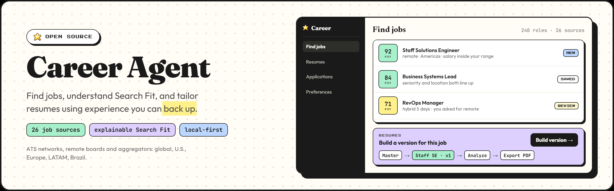
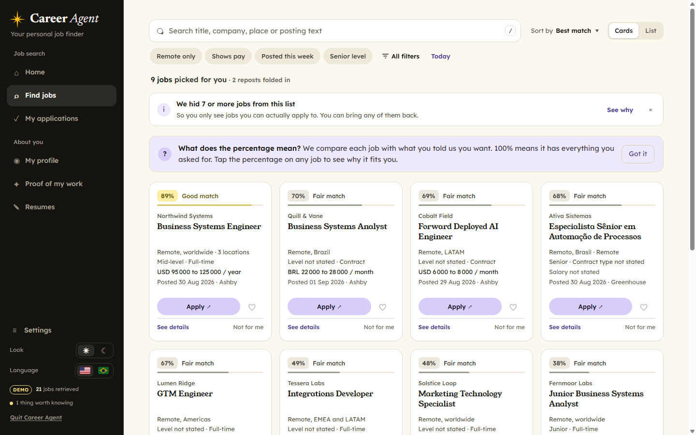
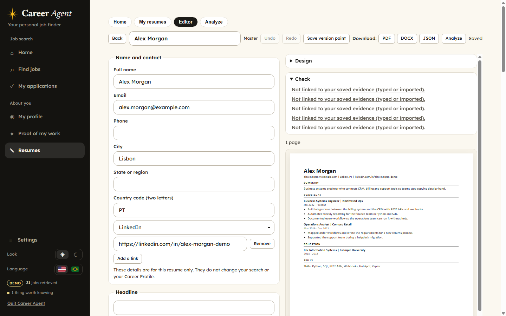
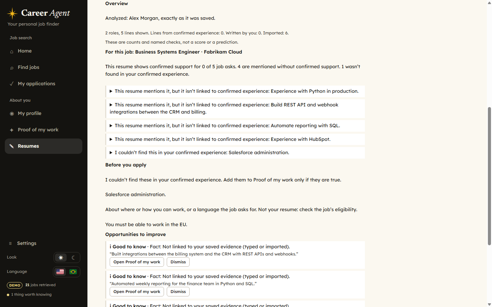
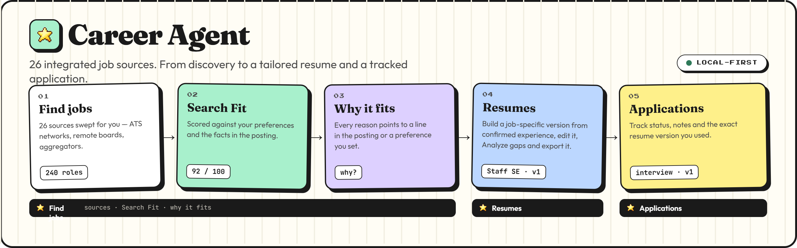

  <a href="README.md"><em>English</em></a> |
  <a href="README.pt-BR.md"><em>Português</em></a> |
  <a href="README.es.md"><em>Español</em></a>

<h1 align="center">✧ <strong>Career</strong> <em>Agent</em> ✧</h1>

  Encontre vagas em <strong>26 fontes integradas</strong>, entenda por que elas combinam com a sua busca e adapte seu currículo usando experiências que você consegue comprovar.

  

  <em>Ilustração do produto com exemplos inventados, não uma captura de tela nem resultados medidos. As capturas reais da demonstração aparecem abaixo.</em>

  
  
  
  

  
  
  
  
  

  <strong>
    <a href="docs/INSTALL.md">Guia de instalação (em inglês)</a>
    &nbsp;·&nbsp;
    <a href="https://github.com/thais-stephanie/career-agent-portfolio/releases/tag/v0.2.0-beta.3">Baixar para Windows</a>
    &nbsp;·&nbsp;
    <a href="#capturas-de-tela">Ver o aplicativo</a>
  </strong>

O Career Agent é um espaço de busca de emprego que roda no seu próprio
computador. Ele coleta vagas públicas de job boards e de sistemas de
recrutamento das empresas, verifica se cada empresa pode contratar você onde
você mora e dá a cada vaga uma nota de **Search Fit** de 0 a 100, citando o
texto da vaga para explicar a nota. Em **Currículos** ficam
seus currículos, e uma versão para uma vaga é feita a partir de experiências
que você confirmou. Seus dados ficam em arquivos dentro da pasta do Career
Agent; nada é enviado para um servidor do Career Agent, porque ele não existe.

> [!NOTE]
>
> Esta é a versão **v0.2.0-beta.3**, para quem roda no próprio computador.
> **Currículos** substitui o Resume Tailor Beta, a ferramenta de currículo das
> betas anteriores; os currículos feitos com ele podem ser trazidos para
> Currículos. O Search Fit descreve como uma vaga
> combina com as suas preferências de busca. Ele não estima suas chances de
> contratação.

## Instalação

Escolha um caminho. O [guia de instalação](docs/INSTALL.md) tem cada passo,
escrito para quem nunca usou um terminal. Ele está em inglês.

- **Uso Claude Code ou Codex:** cole a
  [mensagem de instalação pronta](docs/INSTALL.md#path-a-install-with-claude-code-or-codex)
  nele. Ele instala o Career Agent, roda a demonstração e explica como abrir
  de novo.
- **Quero instalar por conta própria:**
  - **Windows:** baixe `Career-Agent-v0.2.0-beta.3-Windows.zip` na
    [página da versão](https://github.com/thais-stephanie/career-agent-portfolio/releases/tag/v0.2.0-beta.3),
    desbloqueie o arquivo (botão direito, **Propriedades**, **Desbloquear**),
    clique com o botão direito, escolha **Extrair tudo** e dê dois cliques em
    **Start-Demo.cmd** na pasta extraída. Você não precisa instalar Python
    antes: o launcher baixa o uv, que instala o Python 3.12 e as bibliotecas
    travadas. [Passo a passo](docs/INSTALL.md#path-b-on-windows-download-and-double-click).
  - **macOS ou Linux:** instale o uv, extraia o arquivo de código-fonte e rode
    dois comandos. [Passo a passo](docs/INSTALL.md#path-b-on-macos-or-linux-use-the-terminal).
    Essas plataformas não foram testadas nesta versão.

A demonstração abre com 21 vagas inventadas e uma pessoa candidata inventada,
Alex Morgan, em um armazenamento separado do seu. Pare a demonstração com
**Ctrl+C** na janela dela e dê dois cliques em **Start-Career-Agent.cmd** para
configurar a sua busca. O guia também explica
como [abrir de novo](docs/INSTALL.md#how-to-open-career-agent-next-time),
[fazer backup](docs/INSTALL.md#backups), [atualizar](docs/INSTALL.md#updating-to-a-new-version),
[resolver problemas](docs/INSTALL.md#troubleshooting) e
[desinstalar](docs/INSTALL.md#uninstalling).

## Capturas de tela

As três são capturas da demonstração, com vagas sintéticas e uma pessoa candidata inventada. A interface aparece em inglês; ela também tem português.

**Encontrar vagas**

**Editor de currículo**

**Analisar para uma vaga**

*Ilustração do fluxo, não uma captura de tela.*

## O que ele faz

| Área | O que você recebe |
|---|---|
| Descobrir | Vagas de 26 fontes integradas, sem duplicatas, em uma lista, além da importação manual de qualquer vaga. Cada vaga mantém sua fonte e o histórico de coleta. Visões Cards, Table e Board; a Table exporta os resultados GOOD e STRONG atuais em um arquivo CSV. |
| Elegibilidade | Restrições de contratação (país, autorização de trabalho, credencial de segurança) são verificadas separadamente das preferências. "Remoto" nunca é lido como "qualquer lugar do mundo"; uma vaga que não diz onde contrata fica sem resolução. |
| Search Fit | Uma nota de 0 a 100 com uma faixa (STRONG, GOOD, MODERATE, WEAK), motivos citados da vaga e o que a vaga não informou. **Posting completeness** aparece ao lado e nunca altera a nota. |
| Career Evidence | O Career Agent lê seu currículo no seu computador e propõe afirmações. Cada uma só entra no seu Career Profile quando você a confirma. |
| Candidaturas | Status (Encontrada, Tenho interesse, Candidatura enviada, Em entrevista, Proposta, Recusada e outros), notas e histórico das vagas em que você age. |
| Currículos | Um currículo mestre, importação de PDF e Word, uma versão para cada vaga, um editor com prévia ao vivo, exportação em PDF, Word e JSON, adaptação a partir de experiência confirmada e Analisar: achados com nome, nunca uma nota. |

### O que é estável, opcional, experimental ou inexistente

| Recurso | Situação |
|---|---|
| Coleta de 26 fontes, elegibilidade, Search Fit, Career Evidence, candidaturas | Parte deste Beta |
| Perfis locais (várias pessoas em uma instalação) | Parte deste Beta |
| Catálogo local compartilhado de vagas | Parte deste Beta |
| Currículos (Resume Workspace V2) | Beta |
| Rascunho e revisão com IA em Currículos | Opcionais, só quando você aperta os botões |
| Semantic matching (DeepSeek, Claude Code ou Codex) | Opcional, desligado até você iniciar uma execução |
| Leitura com modelo local (Ollama, `qwen3:4b`) | Opcional, roda só neste computador |
| LinkedIn via JobSpy | Experimental, desligado por padrão, por perfil |
| Serviço hospedado ou multiusuário, contas, login | Não implementado |
| Candidatura automática | Não implementado |
| Sincronização em nuvem entre computadores | Não implementado |

## Como o Search Fit funciona

Você descreve o trabalho que quer com as suas palavras. O Career Agent compara
essa descrição com o próprio texto da vaga: responsabilidades, ferramentas,
nível, contrato, modelo de trabalho e salário. Cada ponto está ligado a uma
frase citada da vaga. O título sozinho não vale pontos.

- Uma vaga que não informa o nível é avaliada como Pleno (mid-level).
- Salário ou contrato não informados recebem um valor intermediário, entre
  incompatível e compatível.
- **Role anchors** são os cargos que você tem em mente. Eles orientam quais
  buscas o Career Agent faz (por exemplo no Himalayas e no LinkedIn); não
  somam pontos a uma vaga.
- **Semantic matching** é opcional. Um provedor de IA lê vagas selecionadas e
  diz quais partes da sua busca cada uma atende, com citações. O Career Agent
  aceita apenas citações que encontra na vaga, e a própria aritmética dele
  calcula a nota. Detalhes: [SEMANTIC_MATCHING.md](docs/SEMANTIC_MATCHING.md).

O Search Fit nunca lê suas evidências confirmadas, e Currículos não mostra
nenhuma nota de correspondência.

## Fontes de vagas

O Career Agent possui **26 fontes de vagas integradas** com cobertura global,
dos Estados Unidos, Europa, LATAM e Brasil.

| Cobertura | Fontes integradas |
|---|---|
| ATS e sistemas de empresas | Greenhouse, Lever, Ashby, Workday, Workable, Teamtailor, Rippling, Recruitee, Comeet, Gupy |
| Job boards remotos e globais | We Work Remotely, Remote OK, Himalayas, Jobicy, 4 Day Week, Remotive, Working Nomads, Dynamite Jobs, Arbeitnow |
| Redes e agregadores | a16z Speedrun, Jobgether, Jooble |
| LATAM e Brasil | Get on Board, Recruiterflow, Avlis Talent, Programathor |

Algumas fontes oferecem inventários estruturados completos. Outras
disponibilizam apenas janelas de vagas recentes, feeds limitados ou resultados
só com metadados, por isso o Career Agent registra a cobertura de cada fonte.
**Find jobs** atualiza primeiro as fontes pendentes (não atualizadas no último
dia) e depois avalia as vagas novas e alteradas. **Settings & Sources** mostra
uma tabela de saúde das fontes: quando cada uma funcionou pela última vez,
quais estão pendentes ou desatualizadas (três dias), e dois botões: **Refresh
due sources** (o mesmo que Find jobs) e **Refresh all available sources** (as
atualizadas há pouco também). Nenhum dos dois acorda uma fonte pausada nem
pergunta de novo a um site que recusou antes do fim da espera. Nada é coletado
até você apertar um botão.

[Permissões e observações de cobertura das fontes](docs/SOURCES.md)

### LinkedIn

O LinkedIn restringe a coleta automatizada, então sua linha de fonte continua
marcada como proibida. Cada pessoa pode escolher uma exceção
**experimental** para o próprio perfil: **LinkedIn via JobSpy**, desligada por
padrão e ligada só depois de um aviso em Settings & Sources. Ela faz um número
limitado de buscas (24 por padrão) a partir dos role anchors e das frases de
trabalho, nunca faz login e não guarda senha, cookie ou sessão do LinkedIn.
Quando o LinkedIn recusa, a fonte para e espera um dia em vez de tentar de
novo. Você também pode colar qualquer vaga do LinkedIn na importação manual.

## Perfis locais e catálogo compartilhado

Uma instalação pode ter vários **perfis locais**, por exemplo você e alguém da
sua família. Cada perfil tem suas próprias configurações, role anchors,
currículo, evidências confirmadas, notas de Search Fit, candidaturas, anotações
e currículos. Os dados de um perfil nunca aparecem em outro nem
o influenciam.

Os dados públicos das vagas (vagas, descrições, empresas, boards e o índice de
busca) ficam uma única vez em `data/shared/catalogue.db`, e todos os perfis os
leem. Qual busca de qual perfil encontrou uma vaga fica naquele perfil.

Perfis **não são contas**. Não há login nem senha, e qualquer pessoa que use a
mesma conta do sistema operacional consegue ler os arquivos de todos os
perfis. Detalhes: [MULTI_PROFILE.md](docs/MULTI_PROFILE.md).

## Currículos

Abra **Currículos** pela barra lateral ou pelos detalhes de uma vaga. Comece
com um currículo **mestre** feito a partir do seu Career Profile confirmado,
importe um de um arquivo PDF ou Word (.docx) e revise o que foi lido, ou
comece um em branco. Cada currículo tem um histórico que pode ser restaurado,
e **Meus currículos** agrupa as versões feitas para cada vaga.

Uma versão para uma vaga é montada a partir das suas experiências
confirmadas, sem IA: Currículos lê os pedidos da vaga, encontra o que você
confirmou para cada um e mostra o que não encontrou. **Analisar** confere um
currículo sozinho ou contra uma vaga e diz o que encontrou (um contato
faltando, um número sem evidência, um pedido que o currículo não mostra);
nunca dá uma nota. As exportações em PDF, Word e JSON são conferidas antes do
download. O rascunho e a revisão independente com IA são opcionais: cada um
só roda quando você aperta, e diz antes qual provedor recebe o quê.

Uma frase escrita por Currículos ou por uma IA nunca vira evidência
confirmada, e uma linha que cita evidência que você não confirmou não pode ser
exportada. Detalhes: [RESUME_WORKSPACE.md](docs/RESUME_WORKSPACE.md).

A ferramenta de currículo anterior, o Resume Tailor, foi aposentada. Se você
a usou, Currículos oferece trazer os currículos dela depois de uma cópia de
segurança conferida; nada muda de lugar até você escolher, e os arquivos dela
ficam no seu computador.

## Privacidade

Suas configurações, vagas, notas de Search Fit, anotações, candidaturas, texto
do currículo e evidências ficam nas pastas `data` e `config`, dentro da pasta
do Career Agent. O Career Agent guarda o texto extraído de um currículo, não o
arquivo enviado. Currículos guarda o que você salvou de um currículo importado, não o arquivo. Não
há telemetria, e o aplicativo não criptografa os arquivos.

Estas ações enviam dados para fora do computador, cada uma só quando você a
faz:

| Quando | O que sai |
|---|---|
| Primeira instalação | Downloads do uv, do Python e das bibliotecas travadas. |
| Coletar vagas | Requisições a job boards e sites de empresas, com frases de busca e lugares. Nunca seu currículo ou perfil. |
| LinkedIn via JobSpy (se você ligou) | Frases de busca curtas e lugares, enviados ao LinkedIn. |
| Semantic matching (se você iniciar uma execução) | Suas frases de busca e o texto das vagas selecionadas, para o provedor escolhido. |
| Rascunho ou revisão com IA em Currículos (quando você aperta) | O título e a empresa da vaga e os pedidos que ela cita, e as linhas do currículo e as afirmações confirmadas ligadas a eles, para o provedor que você configurou. Nunca seus dados de contato. |
| Abrir o link de uma empresa | Seu navegador visita aquele site. |

A leitura com modelo local (Ollama) fica no computador: o Career Agent recusa
um endereço do Ollama que não seja local. O inventário completo está em
[PRIVACY.md](docs/PRIVACY.md).

## Validação

A verificação da versão v0.2.0-beta.2 passou em **9.105 testes**, com 7
ignorados e 0 falhas, no Windows 11 com Python 3.12:

| Conjunto | Aprovados |
|---|---:|
| Career Agent, unitários | 7.018 |
| Career Agent, integração | 1.656 |
| Career Agent, navegador | 371 |
| Resume Tailor, Python | 22 |
| Resume Tailor, frontend | 38 |

Ruff, a verificação de formatação, o mypy e as verificações do frontend
passaram. O ZIP da versão foi instalado em uma pasta nova cujo caminho tem
espaços, sem uv nem Python disponíveis antes, e foram verificados a
demonstração, o modo pessoal, conflito de portas, reinício e encerramento, além de uma
atualização a partir da v0.2.0-beta.1 com dados sintéticos. Não
há integração contínua: a verificação roda no computador Windows de
quem mantém o projeto. A [validação da versão](docs/VALIDATION.md) lista os testes
ignorados e as verificações de instalação.

## Limitações conhecidas

- O Windows 11 é a única plataforma testada nesta versão. Há instruções para
  macOS e Linux, mas elas não foram executadas.
- Perfis locais separam dados dentro do aplicativo. Eles não são uma barreira
  de segurança.
- Search Fit: uma revisão manual de resultados recentes encontrou vagas GOOD
  sustentadas principalmente por frases de trabalho genéricas. A nota não foi
  alterada, porque uma mudança precisa antes de um benchmark de qualidade das
  evidências.
- A coleta do LinkedIn é experimental. O LinkedIn pode recusar ou limitar as
  requisições, e uma fonte recusada espera um dia.
- A disponibilidade das fontes muda, e algumas devolvem só janelas recentes ou
  metadados. Uma vaga que não diz onde contrata fica sem resolução.
- A interface do Career Agent está em inglês e português do Brasil.
- A leitura com modelo local leva minutos em um processador de notebook.
- A exportação em PDF precisa do Microsoft Edge ou do Chrome no computador.
- Nenhum provedor de IA hospedado foi chamado durante os testes da versão.
- Alguns conjuntos de validação usados no desenvolvimento são privados e não
  são distribuídos; os testes deles ficam de fora e não contam como aprovados.

## Desenvolvimento

Veja o [CONTRIBUTING.md](CONTRIBUTING.md) para os comandos de desenvolvimento e
a verificação de versão. [Arquitetura](docs/ARCHITECTURE.md),
[permissões das fontes](docs/SOURCES.md) e [auditoria pública](docs/PUBLIC_AUDIT.md)
explicam os limites de engenharia.

## Licença e avisos de terceiros

O Career Agent usa a licença [MIT](LICENSE). O leitor que traz os currículos do Resume Tailor aposentado adapta código dele, sob Apache-2.0 ([licença](licenses/resume-tailor-Apache-2.0.txt), [aviso](licenses/resume-tailor-NOTICE.txt)). As fontes incluídas mantêm suas licenças OFL. Veja o [THIRD_PARTY_NOTICES.md](THIRD_PARTY_NOTICES.md) para os limites entre componentes, dependências e atribuições.

Crédito ao [Career-Ops](https://github.com/career-ops-hq/career-ops) pelos padrões de protocolo que orientaram o trabalho nos adaptadores. Referências de apresentação: [ECC](https://github.com/affaan-m/ECC), [Open Code Review](https://github.com/alibaba/open-code-review), [Ponytail](https://github.com/DietrichGebert/ponytail), [Colibri](https://github.com/JustVugg/colibri). Os avisos distinguem material adaptado, conhecimento de protocolo, inspiração e dependências. Nenhuma afiliação é implícita.
